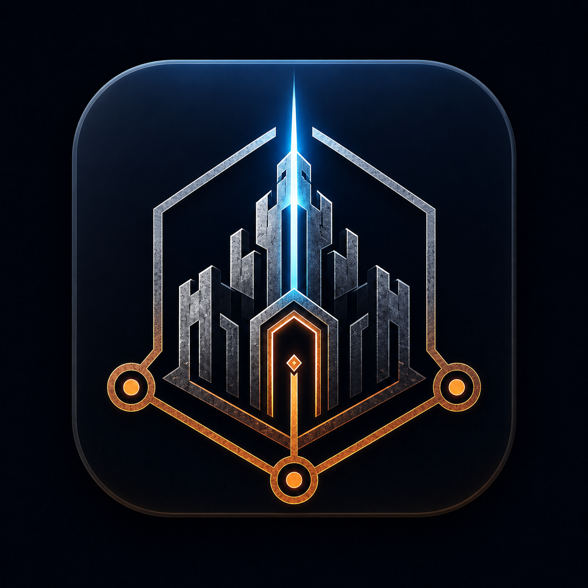

<div align="center">
  
</div>

# AgentPalace

Local-first memory, continuity, and coordination for AI agents, built in Rust.

AgentPalace began as `mempalace-rs`, a Rust implementation of MemPalace, and has grown
to include durable agent workflows, identity continuity, and opt-in federation.

## Existing installations

The executable is now `agentpalace`, MCP tools use `agentpalace_*`, settings use
`AGENTPALACE_*`, and the default installation and data home is `~/.agentpalace`.
The installer migrates an existing MemPalace installation with backups. Stop your
palace servers and their MCP hosts before upgrading, then restart them afterwards.
See the [migration guide](docs/Migration.md) for custom paths, rollback, and the
coordinated client/server cutover. Memories and durable project IDs are preserved.

## Overview

AgentPalace stores conversation and project context locally so your AI can search decisions, debugging history, and project knowledge instead of starting from zero each session. Embeddings, search, and graph operations run locally with no third-party inference API, telemetry, or analytics. Federation is an explicit opt-in exception for sharing selected wings with a palace endpoint you configure.

It provides:

- Semantic search via local embeddings (no external API calls)
- A knowledge graph for structured facts, relationships, and timelines
- An MCP server (`agentpalace serve --stdio`) for agent integration (69 tools)
- Durable task coordination for agent workflows: tasks, messages, artifacts, results, leases, and audit events, available locally and optionally through the federation API
- Provider-neutral agent lineages and reviewed identity packets that preserve a coherent self
  across model and harness changes
- A CLI (`agentpalace`) for direct palace management
- Locator-based mined storage: project file chunks store byte/line ranges instead of duplicated text; snippets are resolved lazily from the checkout at read time with stale detection
- Repository views: `mine` detects the checkout automatically — a full canonical snapshot on the default branch, a branch delta everywhere else — and `search --view <branch>` composes that delta over the canonical snapshot, tombstones included. Force either side with `--full` / `--branch`
- Scoped pruning (`mine`'s inverse): `prune` previews and then deletes mined project data by project, wing, ingest kind, branch view, or path prefix, local palace only
- Background maintenance: fragment compaction, version retention, and vector-index optimization, run automatically by the hub and on demand via `agentpalace maintain`
- Federated project mining: when a wing's route targets a remote palace, `mine` prepares chunks locally and pushes them to the remote server via `POST /v1/ingest/batch`; the server embeds and stores them, so teams can share a single mined index without distributing embedding workload to every client
- Federation: an HTTP server (`agentpalace serve`) shares a palace with other clients; per-wing `local`/`remote`/`combined` routing merges remote and local results, with bearer-token auth and `write: both` local-first dual-write support — see the [Federation guide](docs/Federation.md)

## Quick start

The fastest path is to install the latest stable release, initialize a palace for your project, mine its files, and connect the MCP server to your AI tool. The installer verifies the signed release manifest and artifacts, installs into `~/.agentpalace/bin`, updates your PATH, and registers the server with supported tools when they are detected.

**macOS (Apple Silicon) / Linux (x86_64, glibc 2.38+):**

```bash
curl -fsSL https://raw.githubusercontent.com/DigitumDei/agentpalace/main/install.sh | sh
```

**Windows (x86_64, PowerShell 7.1+):**

```powershell
irm https://raw.githubusercontent.com/DigitumDei/agentpalace/main/install.ps1 | iex
```

Then initialize and mine a project:

```bash
agentpalace init /path/to/project
agentpalace mine /path/to/project
agentpalace status
agentpalace search "your query"
```

Stable releases are the default and are immutable. To install an immutable test candidate, pass `--channel nightly --version v<version>-nightly.<full-commit-sha>` explicitly. Intel macOS, ARM Linux, musl, and other unsupported prebuilt targets require a [source build](docs/Quickstart.md#1b-build-from-source-alternative).

The [Quickstart guide](docs/Quickstart.md) covers source builds, conversation imports, repository views, MCP setup, and lineage configuration. Release operators should follow the [signed release runbook](docs/Release-Operations.md).

The install contains one executable with ONNX Runtime statically linked into it:

```text
agentpalace.exe
ONNXRuntime-NOTICES.txt
```

Use `agentpalace serve` for HTTP MCP at `/mcp` and federation REST on the same port.
Use `agentpalace serve --stdio` for local MCP clients. Regular commands such as `mine`
and `search` use the same executable. See [HTTP MCP setup](docs/Federation.md#http-mcp-endpoint).

## Crates

| Crate | Purpose |
|---|---|
| `agentpalace-cli` | Command-line interface (`init`, `mine`, `project`, `prune`, `search`, `status`, `wake-up`, `setup`, `maintain`, `serve`) |
| `agentpalace-mcp` | MCP dispatcher library, linked into the single `agentpalace` executable |
| `agentpalace-core` | Core types and traits |
| `agentpalace-storage` | Palace persistence layer |
| `agentpalace-ingest` | Content ingestion and chunking |
| `agentpalace-embeddings` | Local embedding model (no external API) |
| `agentpalace-search` | Semantic search |
| `agentpalace-graph` | Knowledge graph |
| `agentpalace-config` | Configuration management |
| `agentpalace-dialect` | AAAK dialect encoding/decoding |
| `agentpalace-import` | Migration from Python palace state |
| `agentpalace-federation` | Shared wire DTOs for the federation REST API |
| `agentpalace-server` | Axum federation REST server (`agentpalace serve`) |
| `agentpalace-remote` | Federation HTTP client (RemoteApi trait + RemoteClient) |
| `agentpalace-a2a` | A2A protocol adapter: translation library between A2A and coordination storage |
| `agentpalace-mcp-tasks` | MCP Tasks extension adapter: translation library between `io.modelcontextprotocol/tasks` and coordination storage |

## Requirements

These apply only when building from source — the prebuilt stable or nightly installers need none of them (including the corporate-SSL configuration below).

- Rust 1.88+
- `protobuf-compiler` (for storage layer)

ONNX Runtime is downloaded by the build and statically linked into the executable.

## Building behind corporate SSL inspection (Netskope, Zscaler, etc.)

Corporate network proxies that perform SSL inspection (Netskope, Zscaler, and similar) intercept TLS connections and re-sign them with a custom root CA. Cargo, model downloads, and deployment downloads must trust that CA. The embeddings crate is configured to download over the OS **native TLS** stack so it trusts your proxy's CA automatically (see section 3); the only thing you normally need to configure is Cargo itself.

The commands and paths below are written for Windows (where native TLS means Schannel and the system certificate store), but the same concepts apply on macOS (Keychain / Security framework) and Linux (OpenSSL reading the system trust store, e.g. `/etc/ssl/certs`) — substitute your platform's CA bundle path and trust store accordingly.

### 1. Cargo HTTP (crates.io index and crate downloads)

Create or edit `~/.cargo/config.toml`:

```toml
[http]
cainfo = "C:/ProgramData/Netskope/stagent/download/nscacert_combined.pem"
check-revoke = false
```

`cainfo` points Cargo's HTTP client at your proxy's CA bundle. `check-revoke` disables certificate revocation checks, which typically time out through an intercepting proxy. Adjust the path to match your proxy's CA bundle — for Zscaler it's usually somewhere under `C:/Program Files/Zscaler/`.

> **Security note:** `check-revoke = false` stops Cargo from checking whether a certificate has been revoked (e.g. after a key compromise), so set it only because the intercepting proxy makes revocation checks unreliable, and scope it to trusted corporate networks. If your proxy's revocation endpoints are reachable, leave it at the default (`true`).

If you don't have the PEM path, open `certmgr.msc`, find your proxy's root certificate under Trusted Root Certification Authorities, export it as Base-64 encoded X.509 (.cer), and use that path.

### 2. ONNX Runtime (downloaded by the embeddings layer's build script)

The `ort-sys` build script downloads a prebuilt ONNX Runtime binary from `cdn.pyke.io` (for example `https://cdn.pyke.io/0/pyke:ort-rs/ms@1.23.2/x86_64-pc-windows-msvc.tar.lzma2`), verifies its hash, and caches it under your local cache directory in `ort.pyke.io/dfbin`. The embeddings crate enables fastembed's `ort-download-binaries-native-tls` feature, so this download uses the OS **native TLS** stack (Windows Schannel) and trusts your proxy's CA from the system certificate store. As long as that root certificate is installed (which Netskope and Zscaler both do by default), **no configuration is needed** — the default rustls-based variant, which ignores the system store and fails behind such a proxy, is not used.

If your firewall filters by domain rather than inspecting TLS, allow `cdn.pyke.io` — the build cannot complete without it.

**Offline / air-gapped builds.** Populate the hash-verified `ort-sys` download cache
on a connected build machine first, then carry that cache into the offline build
environment. Alternatively, point `ORT_LIB_LOCATION` at a compatible **static**
ONNX Runtime build with its required static dependencies. The standard build links
the runtime into `agentpalace`; no ONNX Runtime DLL needs to be deployed. Model weights
remain separate cached files.

### 3. HuggingFace model downloads (embedding models at runtime)

The embeddings layer downloads model files from HuggingFace Hub on first run. Two TLS configurations make this work through SSL inspection:

1. **fastembed** is configured with `hf-hub-native-tls`, so the main download client uses the Windows certificate store and trusts your proxy's CA.
2. **ureq** (the HTTP client used internally by `hf-hub`) has the `native-certs` feature enabled, which makes its rustls TLS backend also load root certificates from the Windows certificate store. Without this, ureq's default rustls would only trust bundled WebPKI roots and reject the proxy's re-signed certificates.

Both are already configured in the workspace — no additional setup is needed as long as your proxy's root certificate is installed in the Windows system certificate store (which Netskope and Zscaler both do by default).

## Documentation

Full index: [docs/README.md](docs/README.md).

- [Quickstart](docs/Quickstart.md) — 5-minute setup
- [Operator guide](docs/Operator-Standard.md) — deployment, maintenance, troubleshooting, storage recovery
- [CLI surface](docs/CLI-Surface.md) — all commands and flags
- [Config schema](docs/Config-Schema.md) — `~/.agentpalace/config.json`
- [Release scope](docs/Release-Scope.md) — what ships, what's deferred, the 69 MCP tools
- [Self-continuity](docs/Self-Continuity.md) — lineages, reviewed self-observations, identity
  packets, and model/harness migrations
- [Low-CPU mode](docs/Operator-Low-CPU.md) — constrained environments
- [Cloud environment](docs/Cloud-Environment.md) — building and testing in a cloud sandbox or CI runner
- [Mined storage](docs/Mined-Storage.md) — locator model, repository views, stale semantics, discovery rules
- [Federation](docs/Federation.md) — running a server, client routing, federated & branch-aware mining
- [Coordination Phase 0](docs/Coordination-Phase-0.md) — experimental durable coordination skill and design findings
- [Release operations](docs/Release-Operations.md) — signed candidate and stable release runbook
- [Hook setup](hooks/README.md) — auto-save for Claude Code

Contributors: documentation is updated in the same change as the behaviour it describes — see
[CLAUDE.md](CLAUDE.md#documentation-must-stay-current).

## License

MIT
