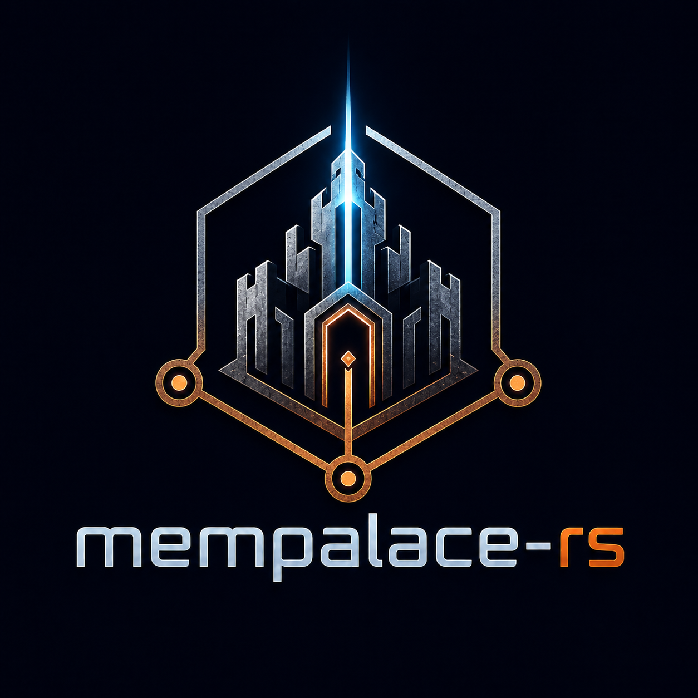

<div align="center">
  
</div>

# mempalace-rs

Rust implementation of MemPalace — a persistent, structured memory system for LLM agents.

MemPalace stores conversation and project context locally so your AI can search decisions, debugging history, and project knowledge instead of starting from zero each session. No external API calls, no cloud — everything runs on your machine.

## Quick start

```bash
cargo build --release -p mempalace-cli -p mempalace-mcp
./target/release/mempalace-cli init /path/to/project
./target/release/mempalace-cli mine /path/to/project
```

Then point your MCP client at `./target/release/mempalace-mcp`.

See the [Quickstart guide](docs/Quickstart.md) for the full walkthrough — building, initializing, mining, searching, and connecting to Claude/Cursor/Cline.

## Overview

MemPalace provides a palace-style memory store with:

- Semantic search via local embeddings (no external API calls)
- A knowledge graph for structured facts, relationships, and timelines
- An AAAK dialect for compact, human-readable memory storage
- An MCP server (`mempalace-mcp`) for agent integration (23 tools)
- A CLI (`mempalace-cli`) for direct palace management
- Locator-based mined storage: project file chunks store byte/line ranges instead of duplicated text; snippets are resolved lazily from the checkout at read time with stale detection
- Branch-delta mining (`mine --branch`): mines only files changed vs the merge-base with the default branch, plus untracked files — keeps the local palace in sync with ongoing branch work without re-ingesting the whole repo
- Federated project mining: when a wing's route targets a remote palace, `mine` prepares chunks locally and pushes them to the remote server via `POST /v1/ingest/batch`; the server embeds and stores them, so teams can share a single mined index without distributing embedding workload to every client
- Federation: an HTTP server (`mempalace-cli serve`) shares a palace with other clients; per-wing `local`/`remote`/`combined` routing merges remote and local results, with bearer-token auth — see the [Federation guide](docs/Federation.md)

## Crates

| Crate | Purpose |
|---|---|
| `mempalace-cli` | Command-line interface (`init`, `mine`, `search`, `status`, `wake-up`, `setup`, `serve`) |
| `mempalace-mcp` | MCP server for agent tool integration |
| `mempalace-core` | Core types and traits |
| `mempalace-storage` | Palace persistence layer |
| `mempalace-ingest` | Content ingestion and chunking |
| `mempalace-embeddings` | Local embedding model (no external API) |
| `mempalace-search` | Semantic search |
| `mempalace-graph` | Knowledge graph |
| `mempalace-config` | Configuration management |
| `mempalace-dialect` | AAAK dialect encoding/decoding |
| `mempalace-import` | Migration from Python palace state |
| `mempalace-federation` | Shared wire DTOs for the federation REST API |
| `mempalace-server` | Axum federation REST server (`mempalace serve`) |
| `mempalace-remote` | Federation HTTP client (RemoteApi trait + RemoteClient) |

## Requirements

- Rust 1.88+
- `protobuf-compiler` (for storage layer)

(ONNX Runtime is downloaded automatically by the build — see the note below if you build behind an SSL-inspecting proxy.)

## Building behind corporate SSL inspection (Netskope, Zscaler, etc.)

Corporate network proxies that perform SSL inspection (Netskope, Zscaler, and similar) intercept TLS connections and re-sign them with a custom root CA. Several build-time dependencies download binaries using their own TLS stacks, which won't trust that CA by default. The embeddings crate is configured to download over the OS **native TLS** stack so it trusts your proxy's CA automatically (see section 3); the only thing you normally need to configure is Cargo itself.

The commands and paths below are written for Windows (where native TLS means Schannel and the system certificate store), but the same concepts apply on macOS (Keychain / Security framework) and Linux (OpenSSL reading the system trust store, e.g. `/etc/ssl/certs`) — substitute your platform's CA bundle path and trust store accordingly.

### 1. Cargo HTTP (crates.io index and crate downloads)

Create or edit `~/.cargo/config.toml`:

```toml
[http]
cainfo = "C:/ProgramData/Netskope/stagent/download/nscacert_combined.pem"
check-revoke = false
```

`cainfo` points Cargo's HTTP client at your proxy's CA bundle. `check-revoke` disables certificate revocation checks, which typically time out through an intercepting proxy. Adjust the path to match your proxy's CA bundle — for Zscaler it's usually somewhere under `C:/Program Files/Zscaler/`.

> **Security note:** `check-revoke = false` stops Cargo from checking whether a certificate has been revoked (e.g. after a key compromise), so set it only because the intercepting proxy makes revocation checks unreliable, and scope it to trusted corporate networks. If your proxy's revocation endpoints are reachable, leave it at the default (`true`).

If you don't have the PEM path, open `certmgr.msc`, find your proxy's root certificate under Trusted Root Certification Authorities, export it as Base-64 encoded X.509 (.cer), and use that path.

### 2. ONNX Runtime (downloaded by the embeddings layer's build script)

The `ort-sys` build script downloads a prebuilt ONNX Runtime binary. The embeddings crate enables fastembed's `ort-download-binaries-native-tls` feature, so this download uses the OS **native TLS** stack (Windows Schannel) and trusts your proxy's CA from the system certificate store. As long as that root certificate is installed (which Netskope and Zscaler both do by default), **no configuration is needed** — the default rustls-based variant, which ignores the system store and fails behind such a proxy, is not used.

**Offline / air-gapped fallback.** If the build can't reach GitHub at all (rather than a TLS-trust problem), download ONNX Runtime once and point the build at it. Using PowerShell:

```powershell
Invoke-WebRequest -Uri "https://github.com/microsoft/onnxruntime/releases/download/v1.23.2/onnxruntime-win-x64-1.23.2.zip" -OutFile "$env:TEMP\onnxruntime.zip"
Expand-Archive -Path "$env:TEMP\onnxruntime.zip" -DestinationPath "C:\onnxruntime" -Force
```

Then add this to `~/.cargo/config.toml` so every build finds it (this overrides the auto-download):

```toml
[env]
ORT_LIB_LOCATION = "C:/onnxruntime/onnxruntime-win-x64-1.23.2/lib"
```

Copy `onnxruntime.dll` and `onnxruntime_providers_shared.dll` from that `lib` directory alongside your built binaries when deploying to another machine.

### 3. HuggingFace model downloads (embedding models at runtime)

The embeddings layer downloads model files from HuggingFace Hub on first run. Two TLS configurations make this work through SSL inspection:

1. **fastembed** is configured with `hf-hub-native-tls`, so the main download client uses the Windows certificate store and trusts your proxy's CA.
2. **ureq** (the HTTP client used internally by `hf-hub`) has the `native-certs` feature enabled, which makes its rustls TLS backend also load root certificates from the Windows certificate store. Without this, ureq's default rustls would only trust bundled WebPKI roots and reject the proxy's re-signed certificates.

Both are already configured in the workspace — no additional setup is needed as long as your proxy's root certificate is installed in the Windows system certificate store (which Netskope and Zscaler both do by default).

## Documentation

- [Quickstart](docs/Quickstart.md) — 5-minute setup
- [Operator guide](docs/Operator-Standard.md) — deployment, troubleshooting, storage recovery
- [CLI surface](docs/CLI-Surface.md) — all commands
- [Config schema](docs/Config-Schema.md) — `~/.mempalace/config.json`
- [Low-CPU mode](docs/Operator-Low-CPU.md) — constrained environments
- [Mined storage](docs/Mined-Storage.md) — locator model, stale semantics, discovery rules
- [Federation](docs/Federation.md) — running a server, client routing, federated & branch-aware mining
- [Hook setup](hooks/README.md) — auto-save for Claude Code

## License

MIT
